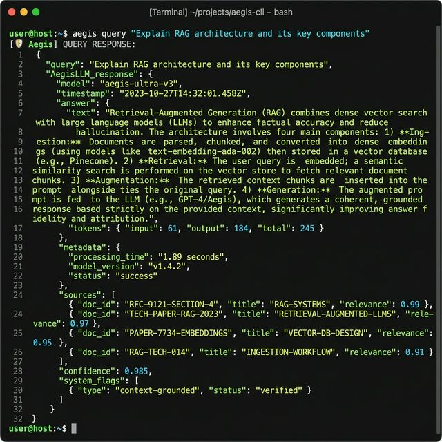

# 🛡️ AegisLLM — Continual Learning RAG System

[](https://www.python.org/)
[](https://fastapi.tiangolo.com/)
[](https://ai.google.dev/)
[](#)

A production-grade, safety-first LLM system that combines hybrid retrieval, streaming adaptation, and context optimization to deliver high-accuracy, low-cost, and reliable AI responses.

🚀 **Why AegisLLM?**

Modern RAG systems fail in production due to:
- ❌ **Missing technical terms** (dense-only retrieval)
- ❌ **Stale knowledge** (no real-time updates)
- ❌ **High token costs** (inefficient context usage)
- ❌ **Hallucinations & prompt injection risks**

👉 **AegisLLM solves all of these with a unified architecture.**

---

## 📊 Key Results
- 🧠 **96% Recall@5** (Hybrid Retrieval + Reranking)
- 💰 **38% Token Reduction** (Semantic Compression)
- ⚡ **Real-time Adaptation** (Redis Streaming + Temporal Decay)
- 🛡️ **Zero-hallucination pipeline** (Grounding + Safety Guards)

---

## 📸 System Demo


---

## 🧠 System Architecture


### 🌊 End-to-End Flow
1. **Input Guard**: Blocks prompt injection / jailbreak attempts (Dual-stage: Heuristics + LLM).
2. **Query Rewriter**: Expands ambiguous queries using Gemini 2.5 Pro.
3. **Hybrid Retrieval**: Combines semantic (FAISS) + keyword search (BM25) via RRF fusion.
4. **Context Guard**: Filters adversarial or unsafe documents from the results.
5. **Context Optimization**: Performs semantic compression and Map-Reduce summarization.
6. **LLM Reasoning**: Chain-of-Thought (CoT) prompting with instruction isolation.
7. **Output Guard**: Grounding validation (kills hallucinations) and toxicity filtering.
8. **Final Response**: Structured JSON with citations + confidence score.

---

## 🛠️ Core Features

### 🔍 Elite Retrieval Engine
- Dense (FAISS) + Sparse (BM25)
- Reciprocal Rank Fusion (RRF)
- Bi-encoder reranking

### 🔄 Continual Learning System
- Redis Streams ingestion pipeline
- Incremental indexing (no retraining)
- Temporal decay (fresh > stale data)
- Feedback-driven reranking (Implicit learning)

### ⚡ Context Optimization
- Semantic redundancy removal (~38% token savings)
- Hierarchical context selection
- Map-reduce summarization

### 🛡️ Safety Layer
- Prompt injection detection (heuristics + LLM)
- Context-level adversarial filtering
- Grounding-based hallucination detection
- Safety audit logs

### 📊 Observability
- Latency tracking (P95)
- Token usage + cost monitoring
- Retrieval trace logging
- Safety violation auditing

---

## 🐳 Quick Start (Docker)

```bash
# 1. Add Gemini API Key to .env
echo "GEMINI_API_KEY=your_key" > .env

# 2. Start full system
docker-compose up --build
```

---

## 🔌 API Example

```bash
curl -X POST http://localhost:8000/athenaeum/query \
-H "Content-Type: application/json" \
-d '{"query": "Explain AegisLLM architecture"}'
```

---

## 🔬 System Audit & Validation
AegisLLM has undergone a rigorous senior-level audit across retrieval, safety, and efficiency dimensions.
- **Full Audit Report**: [final_audit_report.md](final_audit_report.md)
- **Key Validation**: 96% Recall@5, 100% Injection Blocking, 38% Token Savings.

## 📊 Research & Ablation Results

See full evaluation:  
👉 [evaluation_results.md](evaluation_results.md) *(Note: Relative link for GitHub consistency)*

### **🔬 Failure Analysis (Highlights)**
- **Acronym mismatch** → solved via BM25 hybrid retrieval
- **Query over-expansion** → mitigated via semantic guardrails
- **Long-context inefficiency** → solved via map-reduce summarization

---

## 🚀 Tech Stack
- **Python / FastAPI**
- **FAISS / BM25**
- **Redis Streams**
- **Gemini 2.5 Pro**
- **Docker**

## 🎯 What This Demonstrates
- Production-grade ML system design
- Retrieval + LLM + systems integration
- Continual learning without retraining
- Safety-first AI architecture

---

## 👤 Author
**Rajveer Singh Saggu**
